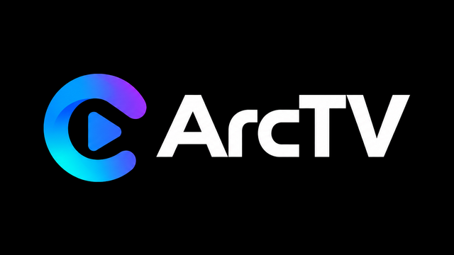
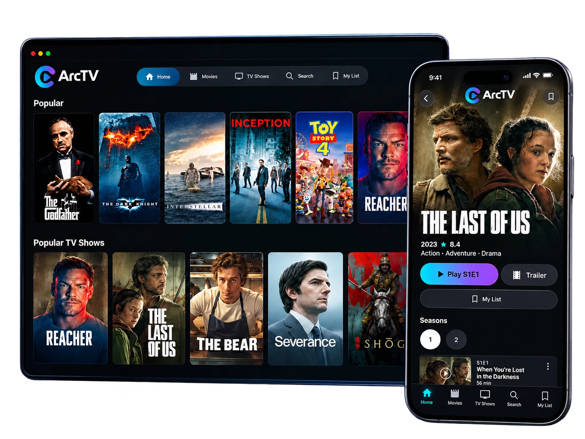

<p align="center">
  
</p>

<h1 align="center">Arc TV for Android phones and tablets</h1>

**Your streaming, your way, in your pocket** — a premium, Netflix-inspired streaming app for Android phones and tablets, built with Kotlin and Jetpack Compose.

This is the phone and tablet version of Arc TV, with the same account, addons, My List and Continue Watching as the [Fire TV app](https://github.com/MikeC444/ArcTV-AndroidTV) and the web app at [web.arctv.org](https://web.arctv.org).

Arc TV is a modern media center that puts everything you love to watch in one place. Content comes from Stremio-protocol addons (`data/provider`, `data/addon`) rather than a fixed built-in catalog, so you choose the addons you want, the same way Stremio itself works.

<p align="center">
  
</p>

## ✨ Features

- **Addon-powered** — discover movies and series from whichever Stremio-protocol addons you install
- **Made for touch** — tap, swipe and drag your way around, held upright or sideways
- **Sync everywhere** — sign in on your phone and your My List, Continue Watching, settings and addons follow you to your Fire TV and the web, and back
- **A player that plays more** — VLC's player is the default, so 4K, HEVC and Dolby Vision files the built-in player can't decode still play; switch to the built-in player any time in **Settings → Player**, and each title remembers the player you picked for it
- **Touch controls** — tap the picture to show the controls, double-tap the left or right side to skip 10 seconds, drag the bar to seek, plus lists for audio, subtitles and playback speed
- **Pick any episode** — an Episodes button in the player, and the next episode starts without leaving it
- **Choose your sound** — set your preferred audio language once, and filter sources by Stereo, 5.1, 7.1 or Atmos
- **Sources that suit a phone** — the source list opens on 1080p, which plays smoothly on phones, with the best 1080p source recommended first
- **Browse your way** — Home, Movies, TV Shows, My List and Search, with a Detail page for every title
- **Picks for you** — a "Picked for you" row that learns your tastes
- **Stays up to date** — the app tells you when a new version is out and what changed (see `RELEASE_NOTES.md`)

## 📱 Installing on your phone or tablet

1. On your phone or tablet, open **[the latest release](https://github.com/MikeC444/ArcTV-MobileAPK/releases/latest)** and download **ArcTV-Mobile.apk**
   (direct link: `https://github.com/MikeC444/ArcTV-MobileAPK/releases/latest/download/ArcTV-Mobile.apk`).
2. Open the downloaded file. Android will ask you to allow installing apps from your browser (or from Files): allow it for this one install.
3. Open **Arc TV**, sign in with your Arc TV email and password (or create an account), and your list and addons are there.

After that the app tells you when a new version is out and what changed, and installs it for you (Android asks you to confirm each update).

Needs Android 6.0 or newer. The app works held upright or sideways.

## 📲 What's different from the Fire TV app

This is the Fire TV app's code, adapted for touch (see `CHANGELOG.md`):

- touch controls in the player, full-screen with the system bars tucked away
- layouts that fit a phone held upright, and keep their TV proportions when turned sideways
- sign in with email and password straight away (no QR code: the phone is the device you would scan with)
- paying for Arc TV Plus opens Stripe's page in your browser; adding an addon is by pasting its address
- no interface sounds, and no speaker or passthrough settings (those are for TVs and receivers)
- sources open on 1080p
- its own app id (`com.mangotv.app.mobile`), so it never replaces the Fire TV app, and its own update channel (this repository's releases)

## 🚀 Status

Arc TV on the phone is full-featured and actively growing. It shares the **account, authentication and cloud synchronization system** with the Fire TV and web apps; the backend lives in the [Fire TV repository](https://github.com/MikeC444/ArcTV-AndroidTV) (`server/`), where `docs/ARCHITECTURE.md` explains how it works and `docs/DEPLOYMENT.md` covers running your own instance. `CHANGELOG.md` here has the development history of this app.

## 🛠️ How it works

The app is Kotlin and Jetpack Compose, talking to the same small Node/Express/TypeScript backend as the Fire TV app, which keeps your account and library in Postgres. Catalogs and streams come from the addons you install. Playback uses VLC's engine (LibVLC) by default, with Media3/ExoPlayer (HLS and DASH) as the built-in alternative.

## 📂 Project structure

```
app/src/main/java/com/mangotv/app/
  data/model/          Content, Genre, Episode, Season, Stream — the shared metadata model
  data/provider/       CatalogProvider interface + ProviderRegistry (Stremio-style addon architecture)
  data/addon/          Stremio addon client/mapper
  data/auth/           Session/device identity, encrypted-at-rest session storage (Tink/Android Keystore)
  data/network/        OkHttp + kotlinx.serialization API clients talking to the backend
  data/sync/           Per-domain cloud sync (settings, watchlist, continue watching, addons), retry queues, account switching
  data/history/        Local Continue Watching cache
  data/player/         Player preferences, last-used source, other-player usage reports
  data/update/         In-app update check against this repository's releases
  ui/theme/            Colors, typography, motion tokens, dimens — the design system
  ui/components/       Reusable primitives: TvFocusSurface, ContentCard, ContentRow, MangoButton, ArcLogo, loading/error states
  ui/mobile/           Phone and tablet layouts: window sizes, navigation shell, Home, Browse grid, Detail
  ui/home/ ui/browse/ ui/detail/ ui/search/ ui/mylist/ ui/sources/ ui/player/  The main app screens
  ui/player/overlay/   In-player menus and cards: audio/subtitle tracks, speed, source info, episodes, choose player
  ui/auth/ ui/profiles/ Sign-in and profile screens
  ui/settings/         Settings, Home Rows, Addons, Account, Player, Audio, Subtitles
  ui/update/           The update pop-up
  navigation/          Jetpack Navigation-Compose routes/nav host
```

## 🏗️ Building

Requires Android Studio (or the command line with an Android SDK installed):

```
./gradlew assembleDebug
```

CI builds a debug APK on every push to `main` and to `claude/**` branches (`.github/workflows/build-apk.yml`), runs the unit tests, and uploads the APK as a workflow artifact, so a build is available for download without needing a local Android SDK.

### Releasing

Push a tag like `v0.2.0` (or run **Build and publish release APK** by hand). It signs the APK and attaches `ArcTV-Mobile.apk` to a GitHub release, with the notes from `RELEASE_NOTES.md` — the same notes the app's update pop-up shows. It needs these **repository secrets** (Settings → Secrets and variables → Actions):

- `API_BASE_URL` — the backend's https address, same as the Fire TV app
- `RELEASE_KEYSTORE_BASE64` — the keystore file, base64
- `RELEASE_KEYSTORE_PASSWORD`, `RELEASE_KEY_ALIAS`, `RELEASE_KEY_PASSWORD`

Using the same keystore as the Fire TV app is fine. This app sends `X-ArcTV-App-Version` and signs in with platform `android_mobile`, so it shows in the developer panel with its version.

The Fire TV app and this one share most code, so a fix made in one usually belongs in the other. `docs/FIRESTICK_PARITY.md` in the web repository tracks what the Fire TV app is missing.

## 🤝 Contributing

Ideas, bug reports and pull requests are welcome. Open an issue to say hi or to tell us what you'd love to see next.
